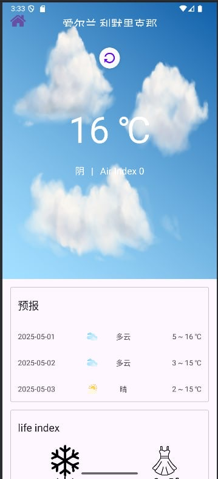

# 彩云天气 (Caiyun Weather) Forecast App

An Android weather forecast application leveraging the Caiyun Weather (彩云天气) API to deliver real-time localized weather information and lifestyle recommendations in Simplified Chinese.Due to API limitations, all text is displayed in Mandarin. We appreciate your understanding.




## 🌟 Key Features

### Weather Information
- **Current Weather Display**: Temperature, weather condition, wind speed/direction, and humidity
- **3-Day Weather Overview**: Yesterday, Today, and Day-After-Tomorrow forecasts
- **Dynamic Weather Icons**: Visual representations based on Caiyun's skycon values (CLEAR_DAY, RAIN, CLOUDY, etc.)
- **Air Quality Index**: Displays real-time AQI data with health recommendations
- **Weather Alerts**: Notifies users of severe weather conditions in their saved locations

### User Experience
- **Intelligent UI**: Automatically switches to dark theme during evening/night hours
- **City Management**:
    - Search by city name (supports both Chinese "上海" and English "Shanghai")
    - Save multiple cities for quick access
    - Easily switch between saved locations
- **Offline Capability**: Access the most recent weather data when no internet connection is available
- **Pull-to-Refresh**: Manually update weather information with a simple swipe gesture
- **Weather Widgets**: Add customizable home screen widgets showing current conditions for favorite cities

### Lifestyle Recommendations
- **Daily Suggestions** including:
    - 🌞 UV Index advisory
    - 🧣 Temperature comfort indicators
    - 👕 Clothing recommendations
    - 🚶 Outdoor activity suitability

**Weather-Based Reminders**: Set customized notifications for specific weather conditions (e.g., "Remind me to take an umbrella when rain is forecasted")
**Historical Weather Data**: View weather patterns for saved locations over the past week to identify trends

### Technical Highlights
- **Full Chinese Localization**: All weather data, city names, and UI elements display in Simplified Chinese
- **Robust Error Handling**: Intuitive loading indicators and user-friendly error messages
- **MVVM Architecture**: Clean separation between API, database, and UI components

## 🛠️ Technology Stack

- **Language**: Kotlin
- **Architecture**: MVVM (Model-View-ViewModel)
- **API Integration**: Retrofit2 + Gson
- **Local Storage**: Room Database
- **UI Components**: RecyclerView, SwipeRefreshLayout
- **Visual Elements**: Day/Night responsive weather icons and dynamic backgrounds

## 🚀 Getting Started

### 1. Clone the Repository
```bash
git clone https://github.com/Zhengyang-code/cs4084-group_06.git
cd cs4084-group_06
```

### 2. Setup Environment
- Open the project in Android Studio (Arctic Fox or newer)

### 3. Configure API Key
- Register for a free API key at [Caiyun Weather Dashboard](https://dashboard.caiyunapp.com/)
- Add your key to `res/values/strings.xml`:
```xml
<string name="caiyun_api_key">YOUR_API_KEY</string>
```

### 4. API Limitations
The free tier of Caiyun Weather API:
- Does not support GPS auto-detection
- Does not provide hourly or weekly forecasts
- Example API endpoint:
  ```
  https://api.caiyunapp.com/v2.6/YOUR_API_KEY/LONGITUDE,LATITUDE/weather?alert=true&dailysteps=3
  ```

## 📂 Project Structure

```
app/
├── activities/
│   └── MainActivity.java
├── fragments/
│   ├── CurrentWeatherFragment.java
│   ├── ForecastFragment.java
│   └── LifestyleSuggestionFragment.java
├── model/
│   └── WeatherResponse.java
├── network/
│   └── WeatherService.java
├── adapter/
│   └── CityAdapter.java
├── database/
│   └── WeatherDao.java
└── res/
    ├── layout/
    ├── drawable/
    └── values/
```

## 📄 License
This project is developed for academic purposes and is licensed under the MIT License.
See the LICENSE file for complete terms.

## 👨‍💻 Contributors
- Zhengyang Li
- Cunxin Yu
- Song Wang
- Yilong Dong

CS4084 Group 06  
University of Limerick, 2025
